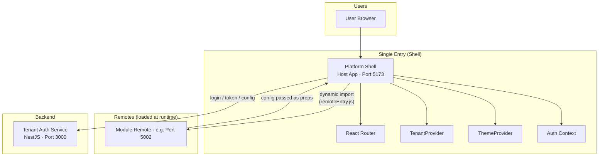
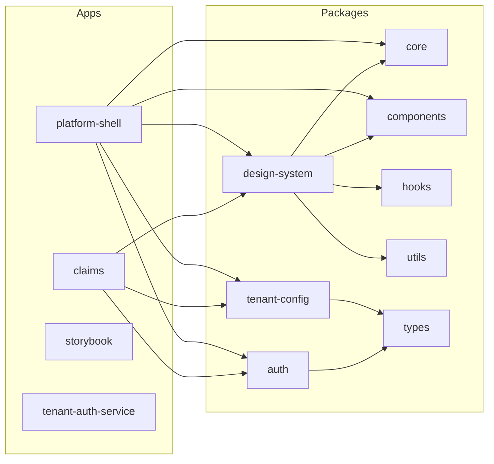
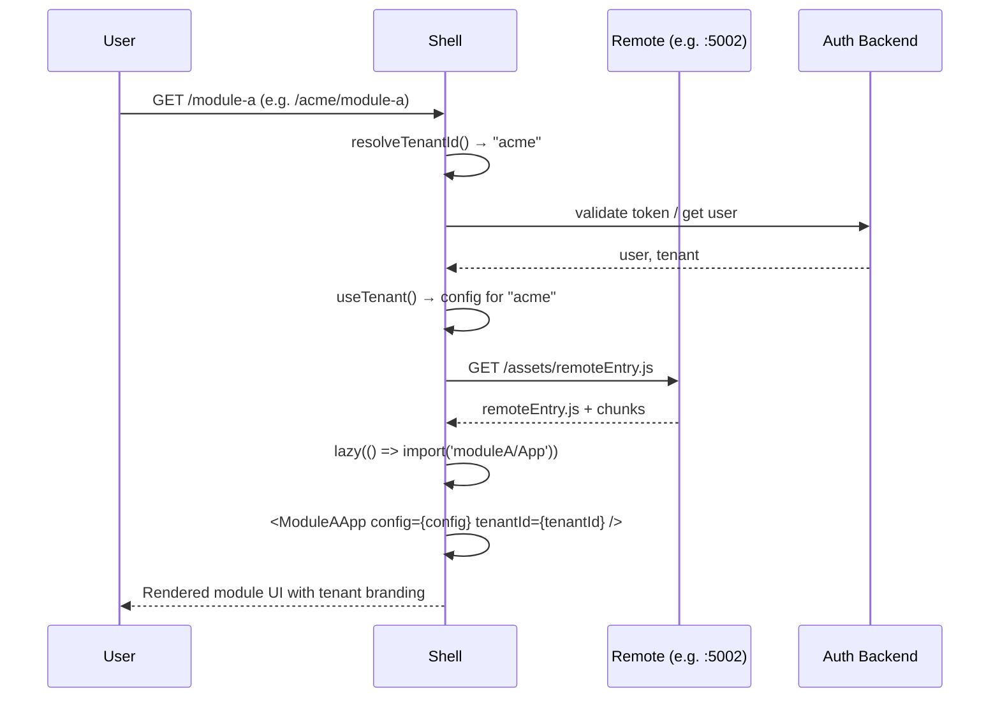
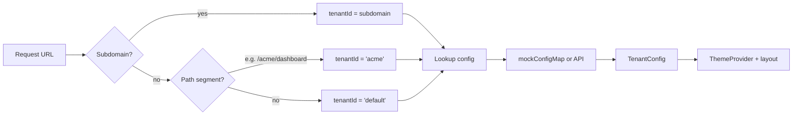
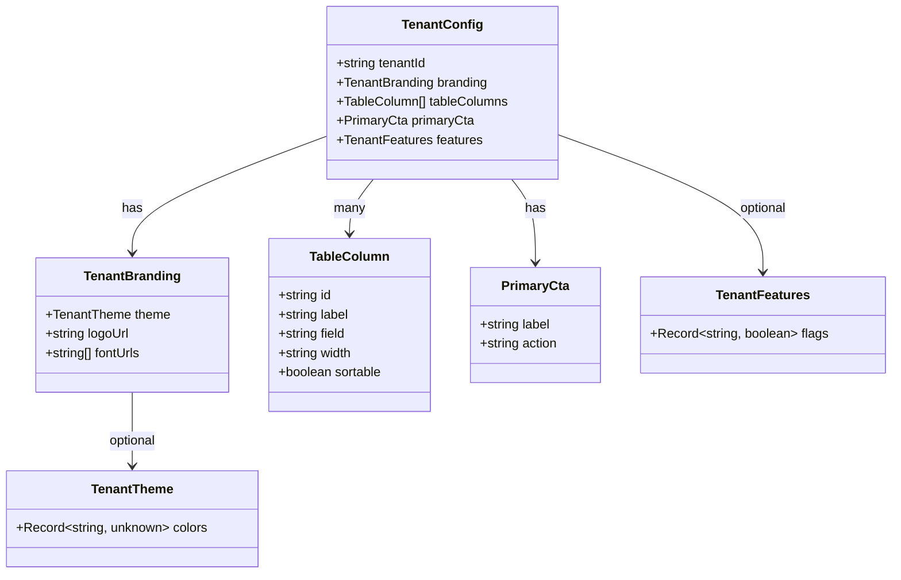
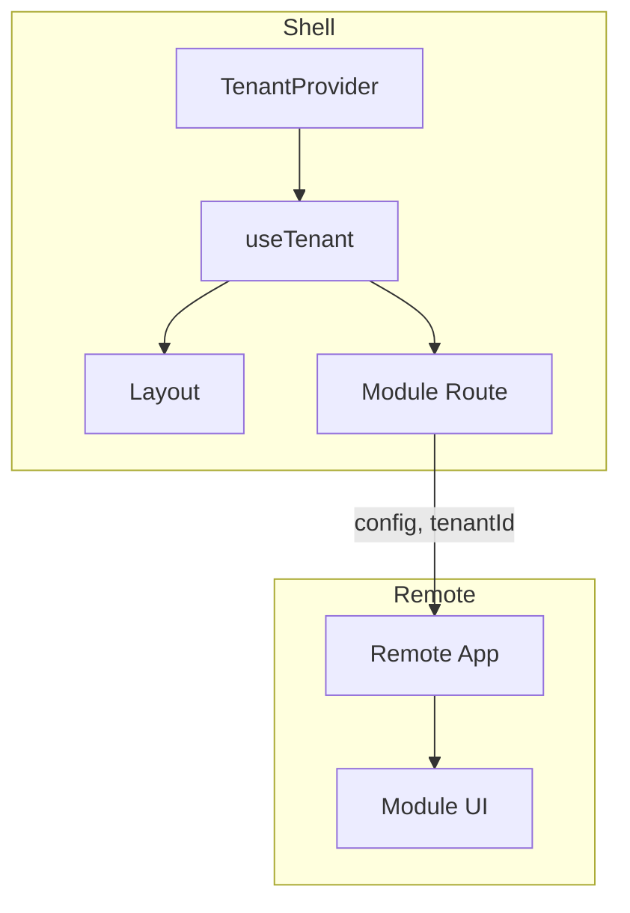
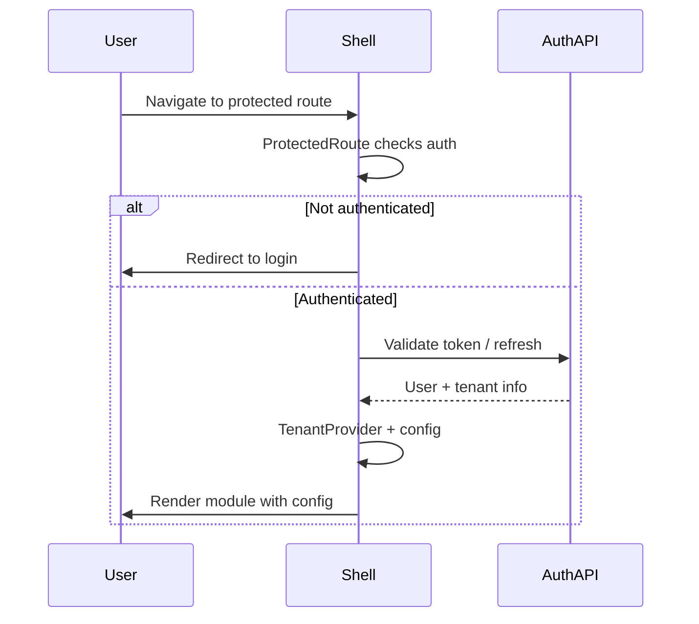
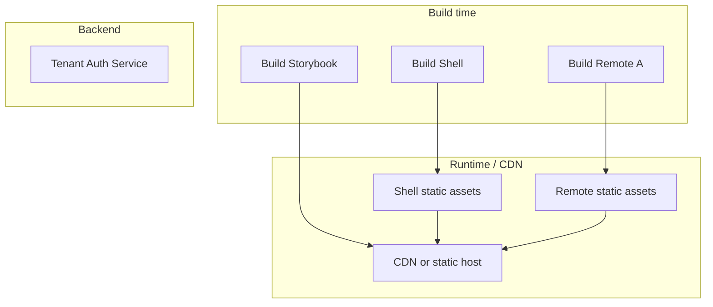

# Building a Multi-Tenant Platform with a Design System and Micro-Frontends

**One codebase, many brands, independent teams—and a clear way to get there.**

---

## Introduction

This article describes an architecture we use for multi-tenant B2B products where several constraints collide: multiple clients (tenants) each want their own branding and feature set, engineering wants a single codebase and shared design system, and product teams need to ship their areas independently. Rather than only listing technologies, we focus on **the problem this class of project has**, **how we reason about solving it**, and **the concrete decisions we made**. The result is a host application (shell) that resolves the tenant, applies tenant-specific config and theme, and loads feature modules (remotes) at runtime via Module Federation—with tenant config passed explicitly into remotes so we avoid the usual pitfalls of context and version mismatch.

The stack is a **pnpm monorepo**, a **shared design system** (tokens, components, theme), **Module Federation** for the shell and remotes, and a **tenant-config layer** (resolution, schema, and optional backend). We use Mermaid for architecture and data-flow diagrams so you can adapt or critique the approach in your own context.

---

## 1. The Problem: A Tension That Belongs to This Class of Projects

Multi-tenant platforms that also support modular frontends run into a specific kind of tension. It’s useful to name it explicitly.

### 1.1 The Core Tension

You need **all** of the following:

- **One product, one URL** – Users should see a single application (e.g. `app.example.com` or `app.example.com/tenant-a`), not a different app per client or per team.  
- **Per-tenant behaviour** – Branding (logo, colours, fonts), visible features, and even labels or table columns must vary by tenant. That implies a **tenant identity** and a **configuration payload** per tenant.  
- **Modular frontends** – Different teams own different areas (e.g. “Module A”, “Module B”). You want them to build and deploy their bundles independently, without a single giant app or a single release train.  
- **Shared design system** – UI must look and behave consistently; tokens, components, and theme should be defined once and reused.  

The failure modes are familiar: **duplicated config types** across repos that drift and break at integration; **React context that doesn’t cross the Module Federation boundary** so remotes throw “must be used within Provider”; **design-system version hell** when every app depends on a published package and every change requires publish–bump–install; and **no single place** to see how tenant id flows from URL to config to UI. So the problem is not “we need multi-tenancy” or “we need micro-frontends” in isolation—it’s that **tenant awareness, modular deployment, and shared contracts** must work together without turning into a mess.

### 1.2 What We Want Out of the Solution

We wanted:

- **A single host** that owns routing, layout, auth, and tenant resolution. The host is the only entry point; remotes are loaded by route.  
- **Tenant config as data** – A well-defined schema (branding, columns, CTAs, feature flags) resolved by tenant id (e.g. from subdomain or path), not hard-coded per tenant.  
- **Remotes that receive config explicitly** – So they don’t depend on React context provided by the host (which doesn’t exist inside the remote’s bundle).  
- **One repository** for apps and shared packages so types and design system stay in sync and we can refactor safely.  
- **Independent builds and deploys** – Shell and each remote can be built and deployed on their own schedule; the monorepo is about code and contract alignment, not a single deploy.

---

## 2. How We Think About Solving It

Before touching implementation, we fixed a few principles. They drive the rest of the design.

**Single host, single entry.** The browser talks to one application (the shell). All tenant resolution, auth, and layout live there. Remotes are not separate “apps” from the user’s perspective; they are route-scoped bundles loaded by the host. That gives us one place to resolve tenant id (e.g. from subdomain or path), one place to load or derive tenant config, and one place to apply theme and auth. We avoid “which app owns the tenant?” and “where do we put the provider?” by making the shell the only owner.

**Tenant config as a first-class contract.** We treat tenant configuration as a typed, versioned contract: a schema (e.g. branding, table columns, primary CTA, feature flags) that the shell and any backend agree on. Tenant id is the key; config is the value. The shell (or a backend) is responsible for resolving that key to a value; the rest of the frontend only consumes it. That keeps tenant-specific logic out of remotes and makes it easy to add new tenants or new config fields without touching remote code.

**No shared React context across the federation boundary.** In Module Federation, the host and each remote are separate bundles. React context created in the host does not exist inside the remote’s bundle—so a remote that calls `useTenant()` is actually calling into its own copy of the hook and its own (empty) context. We ran into that exactly: remotes threw “useTenant must be used within TenantProvider.” The fix is to **pass config (and tenantId) as props** from the host into the remote. The host reads from context; the remote receives data. No magic, no shared context across bundles.

**Monorepo for shared contracts, not for deployment.** We put apps and shared packages in one repo so that the tenant-config schema, auth types, and design system are defined once and consumed everywhere. Builds and deploys remain per-app (shell, remote A, remote B, backend). The monorepo eliminates version drift and enables atomic refactors; it does not force a single deploy or a single release.

**Design system as the single source of truth for UI.** Tokens, components, and theme live in packages; the shell applies tenant theme (from tenant config) via CSS variables and a ThemeProvider. Remotes use the same packages and preset so they stay visually consistent; when they receive config as props, they can also apply tenant-specific colours or copy inside their own views.

These choices are the “how we think about it.” The next sections describe how we implemented them.

---

## 3. How We Solved It: High-Level Architecture

The system is a **pnpm monorepo**: **apps** (shell, remotes, Storybook, optional auth backend) and **packages** (core, components, hooks, utils, design-system, tenant-config, auth, types). The shell is the only host; remotes are loaded at runtime via **Module Federation**. The diagram below summarises the runtime shape.

**In short:** One origin (the shell). The shell resolves the tenant, loads tenant config and theme, and lazy-loads remotes. Remotes receive **config and tenantId as props** from the shell—no context across the federation boundary.

---

## 4. Monorepo Layout

| Layer | Role |
|-------|------|
| **Apps** | `platform-shell` = host (routing, layout, tenant + auth); remotes = feature modules (e.g. one app per domain area); `storybook` = component docs; `tenant-auth-service` = backend auth + tenant config API. |
| **Packages** | `core` = tokens, theme, Tailwind preset; `components` = Button, Card, Input, ThemeProvider; `hooks` / `utils` = shared logic; `design-system` = single entry re-exporting core + components + hooks + utils; `tenant-config` = TenantProvider, useTenant, resolveTenantId, mock/backend config; `auth` = AuthProvider, ProtectedRoute, useAuth; `types` = shared TenantConfig, auth types. |

---

## 5. Why We Use a Monorepo

We keep all apps and shared packages in **one repository**. This section spells out the problems that decision addresses and what we gain.

### 5.1 Problems It Solves

| Problem | Without monorepo | With monorepo |
|--------|-------------------|----------------|
| **Shared types** | Each app has its own copy of `TenantConfig`; they drift and break at integration time. | One `@design-system/types` (or tenant-config) package; all apps and the backend depend on it. Types stay in sync. |
| **Design system consistency** | Apps depend on published npm versions; updating a button requires publish → bump → install in every app. | Apps depend on workspace packages (`workspace:*`). Change the component once; all apps see it. |
| **Atomic changes** | Changing the tenant schema requires a PR in types, then in shell, then in remote—merged in the “right” order. | One PR can update the type, the provider, and all consumers. One review, one merge. |
| **Discoverability** | New joiners don’t know where auth or tenant config lives. | One repo: they see `packages/auth`, `packages/tenant-config`, and how apps use them. |
| **Tooling and CI** | Different repos, different ESLint/TypeScript/configs. | One root config; consistent lint, format, and type-check across apps and packages. |

### 5.2 What It Achieves

- **Single source of truth** – Design tokens, tenant config schema, and auth contracts are defined once and consumed everywhere.  
- **Faster iteration** – Edit a shared component or type and run the host or a remote; no publish step for local dev.  
- **Safer refactors** – Rename a type or a prop; TypeScript and the IDE show breakages across the whole repo.  
- **Independent deployment from one codebase** – You still build and deploy the shell and each remote separately (e.g. different CDN paths or services). The monorepo doesn’t force a single deploy; it keeps code and contracts aligned while you ship pieces independently.  
- **Easier onboarding** – Freshers clone one repo, run one or two commands, and see the full system: host, remotes, auth, and tenant config.

So we use a monorepo **to keep shared code and types in sync, to move fast without version hell, and to allow independent deployment of the shell and remotes from that single codebase.**

---

## 6. Module Federation: Host and Remote

The shell consumes one or more apps as **remotes**. Each remote is built and served (e.g. via `vite preview`) so the host can load `remoteEntry.js`. At runtime, the host fetches the remote bundle and renders it, passing **tenant config and tenantId as props**. We chose this over sharing the tenant-config package as a “federation shared” dependency because sharing a workspace package with the federation plugin led to broken resolution (e.g. the plugin looking for `package.json` in the wrong path). Passing props is explicit and works regardless of how the remote is bundled.

**Configuration (conceptual):**

- **Host (shell)** – `remotes: { moduleA: 'http://localhost:5002/assets/remoteEntry.js' }`, `shared: ['react', 'react-dom', 'react-router-dom']`.  
- **Remote** – `exposes: { './App': './src/App.tsx' }`, same `shared` list.  
- **Why props for config:** React context from the host is not shared with the remote’s bundle. Passing `config` and `tenantId` from the host into the remote is the reliable way to keep tenant behaviour correct and avoid “must be used within Provider” in the remote.

---

## 7. Tenant Configuration Model

Tenant identity is derived from **subdomain or first path segment** (e.g. `acme.example.com` or `example.com/acme`). The shell (and optionally a backend) use this id to load **TenantConfig**.

### 7.1 Tenant Resolution Flow

We implemented `resolveTenantId()` in the tenant-config package: it reads `window.location` (subdomain or first path segment) and returns a string. The shell uses that value to look up config from a static map (e.g. for development or static tenants) or to call a backend at `/tenants/config/:tenantId` when config is managed server-side.

### 7.2 TenantConfig Schema (UML-style)

- **branding** – Drives theme (e.g. `createTheme(config.branding.theme)`), logo in the shell header, and optional font URLs.  
- **tableColumns** – Configurable table columns per tenant (e.g. list/dashboard columns).  
- **primaryCta** – Primary call-to-action for a key screen (label and action type per tenant).  
- **features** – Feature flags (e.g. `export`, `advancedReports`) so the UI can show/hide sections per tenant.

---

## 8. Runtime Data Flow: Shell to Remote

- The **shell** wraps the app in `TenantProvider` (and optionally `AuthProvider`).  
- A route component in the shell calls `useTenant()`, then renders the lazy-loaded remote: `<RemoteApp config={config} tenantId={tenantId} />`.  
- The **remote** uses `config` and `tenantId` as props (and optionally `useTenantOptional()` when run standalone with its own provider). No shared React context is required across the federation boundary.

---

## 9. Auth and Protected Routes

We centralise auth in the shell: JWT (and optional refresh tokens), storage, and route protection live in the host. The shell uses an auth package (e.g. `AuthProvider`, `useAuth`, `ProtectedRoute`) so that unauthenticated users never reach remotes. Remotes are only mounted after the host has validated the user; they can assume “I am rendered only when the user is logged in” and, if needed, receive minimal auth-related data via props rather than relying on shared auth context across the boundary.

**ProtectedRoute** wraps routes that require login; **PublicOnlyRoute** wraps login/signup so logged-in users are redirected away. The same token (or user/tenant info) can be used by the shell to fetch or resolve tenant config when config is loaded from a backend.

---

## 10. Design System Usage

- **Tokens and theme** – `@design-system/core` exposes `tokens`, `createTheme`, and `getCSSVariables`. The shell builds theme from `config.branding.theme` and injects CSS variables via `ThemeProvider`.  
- **Components** – Button, Card, Input, etc. from `@design-system/components` (or via `@design-system/design-system`).  
- **Tailwind** – Apps extend `@design-system/core/tailwind-preset` (or design-system’s preset) so spacing, colors, and typography stay aligned with the tokens.

Remotes that depend on the same design-system package and Tailwind preset stay visually consistent with the shell; when they receive config as props, they can apply tenant-specific colours or copy within their own views.

---

## 11. Deployment View

- **Shell** and **remotes** are built separately; the shell’s `remotes` config points to the URL where each remote’s `remoteEntry.js` is served (e.g. same origin or a different CDN path).  
The auth backend (e.g. tenant-auth-service) runs as a separate service; the shell calls it for login and, if we’re not using static mock only, for tenant config. Shell and remotes remain static assets; only the backend is a long-running process.

---

## 12. Summary and Takeaways

| Topic | Takeaway |
|-------|----------|
| **Problem** | The tension is multi-tenancy + modular frontends + shared design system; failure modes are type drift, context across bundles, and version hell. |
| **How we think** | Single host; tenant config as contract; no shared context across federation; monorepo for contracts; design system as single source of truth. |
| **Monorepo** | One repo keeps types and design system in sync and enables atomic refactors; deployment stays per-app. |
| **Module Federation** | Host loads remotes at runtime; we pass **config and tenantId as props** so remotes never depend on host context. |
| **Tenant config** | One schema (branding, columns, CTAs, features); tenant id from subdomain or path; config from static map or API. |
| **Auth** | Auth lives in the shell; remotes are only rendered after the host has validated the user. |

In practice this gives **one codebase, one URL, and one layout**, with **per-tenant branding and features** and **independent deployment** of the shell and remotes. It fits any multi-tenant B2B or SaaS product; you extend by adding remotes and expanding the tenant config schema as needed.

---

## 13. For Freshers: What to Learn to Gain This Experience

If you’re early in your career and want to work on (or understand) systems like this, the sections below are a recommended order of study and practice. Each builds on the previous.

### 13.1 Foundations (must-have)

| Topic | Why it matters | How to practice |
|-------|----------------|-----------------|
| **React (components, hooks, context)** | The shell and remotes are React apps; context is used for tenant and auth. | Build a small app with `useContext` and a provider; then add a “child” app that receives data via props. |
| **TypeScript (types, interfaces, generics)** | TenantConfig, auth types, and API contracts are shared; types prevent drift. | Define an interface (e.g. `User`), use it in 2–3 files, then change it and fix breakages. |
| **REST / HTTP and auth (JWT, refresh tokens)** | The shell talks to an auth backend; you need to understand login, tokens, and protected routes. | Build a tiny backend (e.g. Express/NestJS) that issues a JWT and a frontend that sends it in `Authorization` and guards routes. |

### 13.2 Monorepos and tooling

| Topic | Why it matters | How to practice |
|-------|----------------|-----------------|
| **Package managers and workspaces (pnpm/npm/yarn)** | Monorepos use workspaces so apps depend on local packages without publishing. | Create a pnpm workspace with two packages and one app that imports from both. |
| **Build tools (Vite, esbuild)** | The host and remotes are built with Vite; you need to understand entry points and env. | Scaffold a Vite React app, add a path alias to a local “lib” folder, and run build. |
| **Shared TypeScript config** | One `tsconfig.base.json` keeps strictness and paths consistent. | In a monorepo, make one package depend on another and use `paths` in `tsconfig`. |

### 13.3 Architecture and patterns

| Topic | Why it matters | How to practice |
|-------|----------------|-----------------|
| **Module Federation (host/remote)** | Remotes are loaded at runtime; the host doesn’t bundle them. | Follow a “Vite + Module Federation” tutorial: one host app, one remote, shared React. |
| **Multi-tenancy (tenant id, config per tenant)** | One app serves many tenants; tenant id drives branding and features. | Build a tiny app that reads “tenant” from the URL and shows different colors or labels. |
| **Design systems (tokens, theme, components)** | Shared UI and theming come from a design-system package. | Create a small “core” package with a theme object and a “components” package with one Button that uses it. |

### 13.4 Sections to include in your own article or portfolio

When you document a similar project (e.g. for a blog or portfolio), include:

1. **Problem statement** – What business or technical problem does this solve?  
2. **High-level architecture** – One diagram (e.g. Mermaid) showing shell, remotes, and backend.  
3. **Why monorepo** – What would go wrong with multiple repos? What do we gain?  
4. **Data flow** – How does tenant id flow from URL → config → UI? A short sequence or flowchart.  
5. **Tenant/config model** – A small UML or type definition (e.g. TenantConfig and branding).  
6. **Auth and security** – How are routes protected? Where are tokens stored and sent?  
7. **Deployment** – How are shell and remotes built and deployed (e.g. static host, CDN)?  
8. **What you’d do next** – More remotes, more config fields, or different tenant resolution.

Including these sections signals that you understand both the mechanics and the reasoning—the “why” behind the “how”—which is what senior engineers and interviewers look for when they review design work.

---

## References and Further Reading

- **Module Federation:** [Vite Plugin Federation](https://github.com/originjs/vite-plugin-federation)  
- **pnpm workspaces:** [pnpm Workspaces](https://pnpm.io/workspaces)  
- **Design tokens and theming:** Your `@design-system/core` and `design-system` packages (tokens, createTheme, Tailwind preset)

---

*You can use the Mermaid diagrams in this document as-is in Markdown (e.g. GitHub, GitLab) or render them to images (e.g. [Mermaid Live](https://mermaid.live)) for Medium or LinkedIn. For LinkedIn, a single compelling diagram (e.g. “High-Level Architecture” or “Runtime Data Flow”) plus a short summary often works best.*
